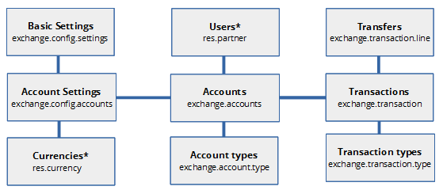
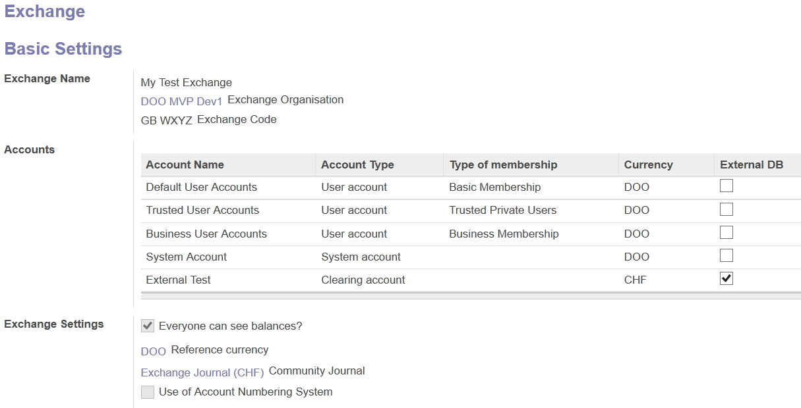
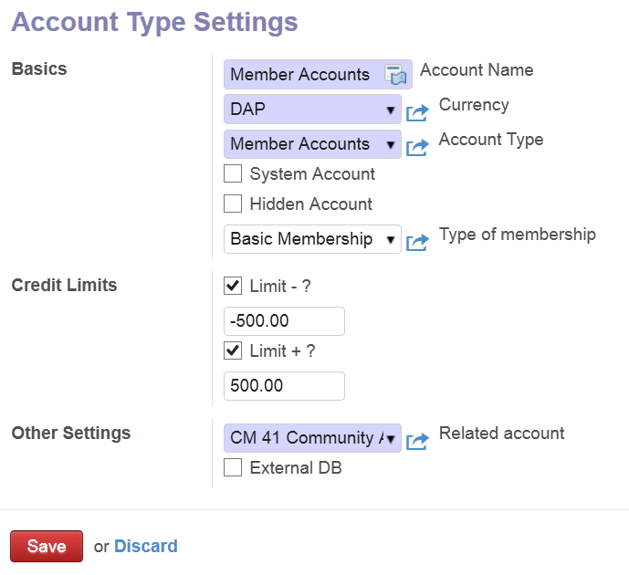
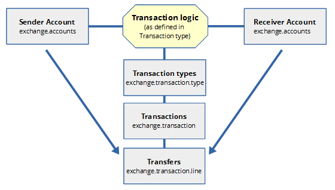

1 Overview 
=====================================================================================

 

The aim of the CoÐoo transaction engine is to get a kind of multipurpose module to cover many aspects toward the use of Community / Crypto Currencies in Odoo.
 

Beside to serve as future inside Odoo transction engine it is planned to add a simulation module, that enables to simualte the full range of different kind of communitiy currencies inside CoÐoo Exchange. Another very interesting feature is that it can be used as wallet to run external transactions engines as Bitcoin/Etherium or Eris for instance.
Here a not yet complete list of different possibe usecase:
 

1.  Rapid prototyping for currenncy systems, to get feedback 
    and improve
    
2.  Simulation tool which enables to run tests on
    different kind of communitiy or corporate currencies

3.  Basics of a Odoo integrated wallet for distributed  	ledgers and smart-contracts
 

> Note:
> The existent transaction engine of Vertical Community was not flexible enough on the one hand and on the other complex, because it was completely integrated into the Odoo accounting system. 
Out of this reason we started to refactor the code into a more straightforward solution and used the new ORM API for it. The specification are build upon this refactored transaction engine called
> Vertical Exchange.

 2 Specifications
=================================================================================================

 
This are some draft specification to help developers to get a quick overview about the CoÐoo Exchange framework.

 

 2.1 Vertical Exchange
-----------------------------------------------------------------------------------------------------------

Vertical Exchange contains about six Odoo modules, some of them are more or less untouched copied from Vertical Community, some contain quite new code.

To avoid compliance problem the whole set of modules from Vertical Community has been forked into two new projects Vertical Exchange” and “Vertical Community2”.

Vertical Community2 contains all modules that are not related to Exchange or Marketplace. The Vertical Exchange project contains the Exchange and Marketplace Modules. 

 

###  2.1.1 Basic Data Model 

The Basic Data Model is very flexible and extensible to future needs. It is built analogue of the Cyclos 3.6 transaction engine model.

 
 
Beside of \*res.currency and res.partner also others standard models of Odoo are accessed, but this are the most important.

An addition model id distributed\_db what contains settings for attaching an external ledger or any DB distributed or not.

A more detailed data model is accessible here:

<https://github.com/codoo/vertical-exchange/docs/dev>

### 2.1.2 Functionality

The easiest way to explain the functionality is according some screenshots:

###  2.1.3 Settings

We see in the accounts section three type of
accounts, one for member Member and two System
accounts. A System Account is a single account that belongs to the System or organisation. Member accounts are templates for the member that are in a group of membership. Membership is a function of the Odoo Association app.

Each account can have a currency and could theoretically use an outside transaction engine.

The settings, as any other model, can easily extended via the
inheritance function Odoo.

Consequently the settings for each account type look looks as this
example.

 

Related account is the account of the Odoo accounting system. This
option allows the integration of an exchange into the accounting system.

When you click on External DB a new field appears where you can open the
settings for External DB's.

 
### 2.1.4 Transactions 

Transaction are performed as following scheme shows.

 

 
 
For a transaction type it is also possible to ad one
or more follow up transaction, for example to charge transaction
fees.

